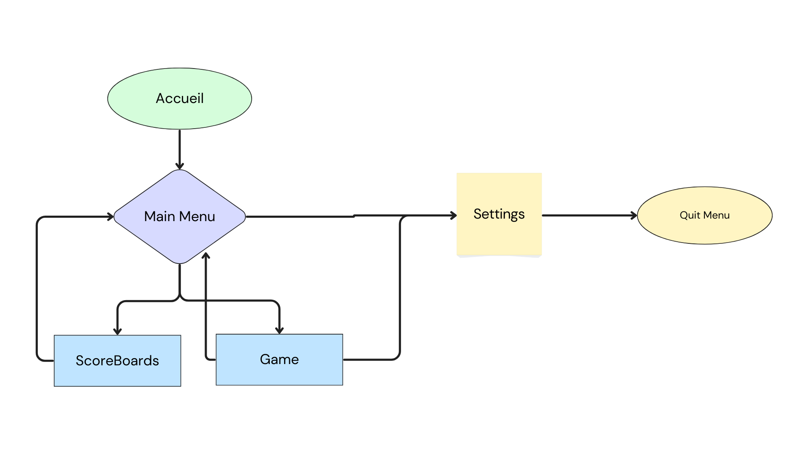
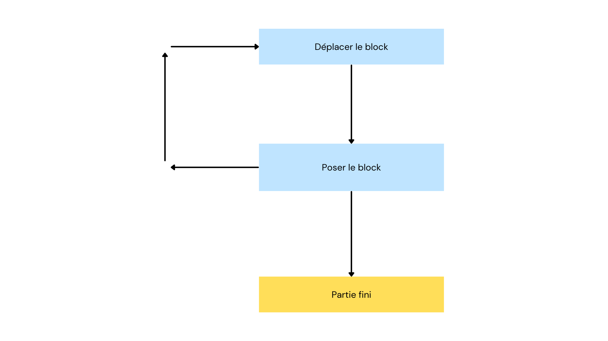

# 2. Parcours Utilisateur

- **Menu d'Accueil**  
  Écran d'accueil de l'utilisateur avec un bouton très visible "Prêts".
  

- **Transition**  
  Passage fluide entre les menus.

- **Menu Principal**  
  Le menu principal permet au joueur de choisir entre plusieurs options : commencer une partie, consulter le tableau des scores, paramétrer ses touches, ou quitter le jeu.

    - **Écran de Jeu**  
      Le joueur interagit dans une boucle de gameplay immersive.
      

        - **Menu de Fin de Partie**  
          Une fois la partie terminée, le joueur a le choix de quitter ou de relancer une nouvelle partie.

- **Menu Tableau des Scores**  
  Le joueur peut comparer ses statistiques avec celles des autres joueurs et voir son classement parmi tous les participants.

- **Menu Options (accessible via la touche Échap)**  
  - **Menu Paramètres**  
    Le menu des paramètres est distinct des autres menus et n'est accessible que si le joueur en fait la demande.  
    Il permet également de quitter la partie.